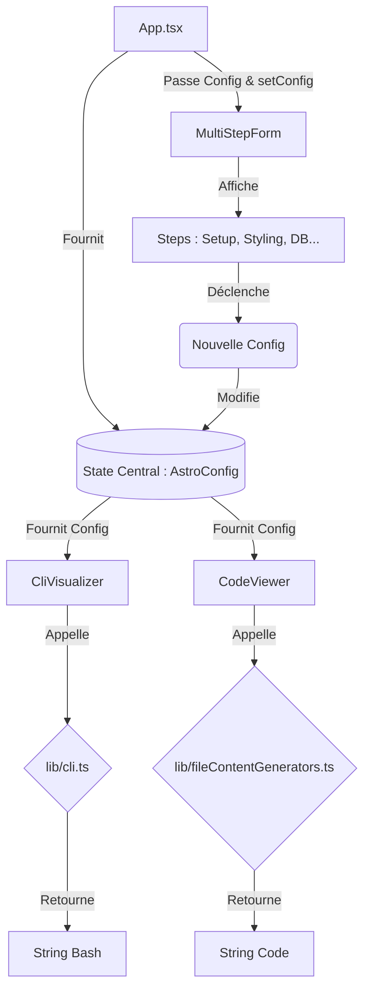

# 🌌 NKBOOTING PRIME : Le Manuel de l'Architecte (V1.0.0-Alpha)

> **"L'outil ultime pour forger, visualiser et maîtriser des architectures Astro sur-mesure."**
>
> Ce document est la **bible intégrale** du projet. Il va bien au-delà d'un simple README : il englobe le guide de démarrage, les diagrammes de flux d'état, l'audit de sécurité, la roadmap technique, et la vision long-terme (Moonshots) de l'application.

---

## 📑 Table des Matières

1. [Vision & Fonctionnalités (Features)](#1-vision--fonctionnalités-features)
2. [🚀 Quick Start (Démarrage Local)](#2--quick-start-démarrage-local)
3. [🔑 Environnement & Sécurité](#3--environnement--sécurité)
4. [🧠 Architecture & Data Flow (Diagramme)](#4--architecture--data-flow)
5. [Cartographie de la Codebase](#5-cartographie-de-la-codebase)
6. [Stack Technique & Écosystème](#6-stack-technique--écosystème)
7. [🚨 L'Audit Définitif : Failles & Bottlenecks](#7--laudit-définitif--failles--bottlenecks)
8. [🗺️ Roadmap Architecturale (V1 -> V2)](#8-️-roadmap-architecturale-v1---v2)
9. [🌌 Vision Long-Terme (Moonshots)](#9--vision-long-terme-moonshots)
10. [Guide d'Extension](#10-guide-dextension)
11. [🤝 Guide de Contribution](#11--guide-de-contribution)

---

## 1. Vision & Fonctionnalités (Features)

NKBOOTING PRIME est un configurateur (Wizard) interactif "Split-Screen". Il permet de designer un projet Astro complet (Front, Back, Auth, ORM, Thème) et de voir le résultat (CLI + Code) muter en temps réel.

### 🌟 MVP Actuel
- **Wizard Dynamique (`MultiStepForm`) :** Setup, Intégrations, Styling, DB & Auth, Thème, Schémas.
- **Moteurs de Rendu Temps Réel :** `CliVisualizer` (Commandes Bash) et `CodeViewer` (Fichiers générés).
- **A11y (Accessibilité) :** Calcul mathématique des contrastes en temps réel (`ContrastBadge`).

---

## 2. 🚀 Quick Start (Démarrage Local)

Pour faire tourner NKBOOTING PRIME sur votre machine, suivez ces étapes :

### Prérequis
- Node.js (v18 ou supérieur recommandé)
- npm, pnpm ou yarn

### Installation
```bash
# 1. Cloner le dépôt
git clone https://github.com/votre-user/nkbooting-prime.git
cd nkbooting-prime

# 2. Installer les dépendances
npm install

# 3. Démarrer le serveur de développement (HMR activé)
npm run dev
```
L'application sera accessible sur `http://localhost:3000`.

---

## 3. 🔑 Environnement & Sécurité

Pour utiliser les fonctionnalités boostées à l'IA (génération de schémas, assistance), une clé API Google Gemini est requise.

1. Créez un fichier `.env.local` à la racine.
2. Ajoutez votre clé :
```env
# .env.local
GEMINI_API_KEY="AIzaSyYourSecretKeyHere..."
```

⚠️ **ATTENTION (Dette Technique actuelle) :** Dans la version actuelle, cette clé est exposée au frontend via `vite.config.ts`. Cela est acceptable **uniquement en développement local**. Pour la production, cette architecture doit basculer sur un proxy backend (voir section [Audit](#7--laudit-définitif--failles--bottlenecks)).

---

## 4. 🧠 Architecture & Data Flow

Voici comment circule l'information dans l'application. NKBOOTING PRIME suit un modèle **Unidirectional Data Flow** strict.



---

## 5. Cartographie de la Codebase

```text
/
├── App.tsx                    # 🧠 CŒUR : Contient le State global (config) et le Layout Split-Screen
├── types.ts                   # 🗄️ CONTRAT : Toutes les interfaces (AstroConfig) et Enums (Template, DbProvider)
├── index.html                 # 🌐 ENTRY : Contient le CDN Tailwind et l'import map
├── vite.config.ts             # ⚙️ BUNDLER : Config Vite, alias `@/`, et variables d'env
│
├── /components/               # 🧩 INTERFACES UTILISATEUR
│   ├── MultiStepForm.tsx      # Contrôleur de pagination du Wizard
│   ├── CliVisualizer.tsx / CodeViewer.tsx # Vues Temps Réel
│   ├── /form/                 # Composants UI purs (Options, Boutons)
│   ├── /steps/                # 📂 LES ÉTAPES (InitialSetup, DbAuth, Theme...)
│   └── /theme/                # 🎨 MOTEUR DE THÈME (Éditeur, Contrastes WCAG)
│
└── /lib/                      # ⚙️ LOGIQUE MÉTIER & FONCTIONS PURES
    ├── cli.ts                 # Config -> String (Commandes CLI)
    ├── fileContentGenerators.ts # Config -> String (Code Source Astro)
    └── schema.ts, theme.ts... # Utilitaires de données statiques
```

---

## 6. Stack Technique & Écosystème

| Couche | Technologie | Justification |
| :--- | :--- | :--- |
| **View / UI** | `React ^19.2` | Rendu déclaratif, préparation pour hooks concurrents. |
| **Language** | `TypeScript` | Sécurité absolue lors de la génération dynamique de code. |
| **Bundler** | `Vite ^6.2` | HMR ultra-rapide, build optimisé. |
| **Styling** | `Tailwind CSS` | Actuellement via CDN (problématique, voir Audit). |
| **Icons** | `lucide-react` | Icônes SVG scalables et minimalistes. |
| **AI / LLM** | `@google/genai` | SDK Gemini pour la future génération de schémas complexes. |

---

## 7. 🚨 L'Audit Définitif : Failles & Bottlenecks

### 🛑 Sécurité : Fuite de Clé API Gemini
- **Le Problème :** `vite.config.ts` injecte `GEMINI_API_KEY` dans le bundle client via `define`. N'importe quel visiteur peut voler la clé.
- **Le Fix :** Supprimer cette injection. Créer un backend (ex: Express ou Hono) pour servir d'intermédiaire sécurisé `/api/generate`.

### 📉 Performance : Re-renders globaux
- **Le Problème :** Le `useState` massif dans `App.tsx` re-rend tout le DOM (y compris les visualiseurs de code complexes) à chaque frappe de clavier.
- **Le Fix :** Implémenter **Zustand** avec des sélecteurs d'état. Ajouter un *Debounce* sur les inputs textuels.

### 🏗️ Dette Technique : Tailwind via CDN
- **Le Problème :** Le tag `<script>` Tailwind dans `index.html` est conçu pour le prototypage, pas pour la production (FOUC, lenteur, pas de minification).
- **Le Fix :** Installer Tailwind nativement via `postcss`.

### 💾 Expérience Utilisateur : Zéro Persistance & Zéro Export
- **Le Problème :** Un F5 efface tout. Impossible de télécharger le projet généré.
- **Le Fix :** Synchroniser l'état avec le `localStorage`. Intégrer `JSZip` pour générer et télécharger l'archive du projet.

---

## 8. 🗺️ Roadmap Architecturale (V1 -> V2)

1. **Sprint 1 (SecOps & Build) :** Retrait API Key du front, intégration Tailwind native.
2. **Sprint 2 (State & UX) :** Migration vers Zustand, sauvegarde LocalStorage.
3. **Sprint 3 (Features Core) :** Implémentation de `JSZip` -> Bouton **"Télécharger le Projet"**.
4. **Sprint 4 (Qualité) :** Ajout de `Zod` (Validation de formulaires) et `Vitest` (Tests unitaires des générateurs de code).

---

## 9. 🌌 Vision Long-Terme (Moonshots)

Voici ce que NKBOOTING PRIME pourrait devenir d'ici 1 à 2 ans :

1. **WebContainers API (StackBlitz) :** Au lieu d'afficher bêtement du code, le navigateur exécuterait **réellement** le projet Astro généré dans un terminal in-browser (via WebAssembly), offrant une preview live du site sans quitter l'app !
2. **1-Click Deploy (GitHub / Vercel) :** Connexion OAuth permettant à l'utilisateur de cliquer sur un bouton pour que l'app crée le repo GitHub et déclenche un déploiement Vercel ou Netlify automatiquement.
3. **AI Pair Architect (Gemini) :** Un mode "Copilot" intégré où l'utilisateur dit : *"Je veux un blog avec auth et commentaires"* et l'IA configure toutes les étapes du Wizard automatiquement, proposant des schémas Drizzle optimisés.
4. **Système de Plugins (Extensibilité) :** Permettre à la communauté de créer des plugins pour ajouter leurs propres frameworks ou ORM sans toucher au Core de l'application.

---

## 10. Guide d'Extension

Pour ajouter une nouvelle base de données (ex: *Turso*) :
1. **Contrat (`types.ts`) :** Ajoutez `Turso = 'turso'` dans `enum DbProvider`.
2. **UI (`StepDbAuth.tsx`) :** Ajoutez la carte cliquable avec le logo Turso.
3. **CLI (`lib/cli.ts`) :** Ajoutez le comportement d'installation (`npm i @libsql/client`).
4. **Code (`lib/fileContentGenerators.ts`) :** Modifiez les templates pour inclure la connexion Turso.

---

## 11. 🤝 Guide de Contribution

Les Pull Requests sont les bienvenues. Avant toute soumission :
1. Assurez-vous que vos fonctions génératrices de code dans `/lib` restent des fonctions **pures** (sans effets de bord).
2. Si vous ajoutez un nouveau paramètre de configuration, n'oubliez pas de mettre à jour l'interface `AstroConfig` et la fonction `getInitialSchema`.
3. Respectez les conventions ESLint/Prettier (à venir).
